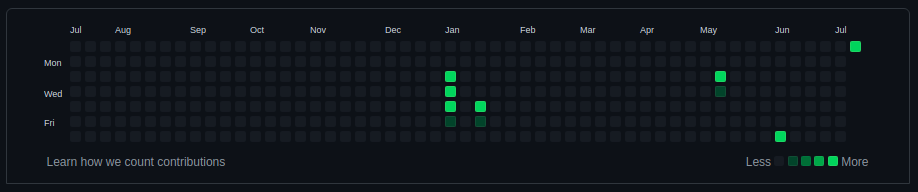

<h1 align="center">GH Streaks :fire:</h1>
<p align="center">Your amazing GitHub contribution graph is just a few clicks away</p>

<p align="center">


</p>

## How to use

### 1. Fork this repo


### 2. Clone forked repo on your desktop

```bash
git clone https://github.com/<username>/GH-Streaks.git
cd GH-Streaks
```

### 3. Install requirements

```bash
pip3 install -r requirements.txt
```

### 4. Run this command and push changes

```bash
python3 streaks.py --days <days: int>
```

For example

```bash
python3 streaks.py --days 365
```

## Result

### Before



### After


